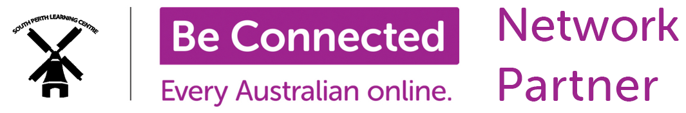
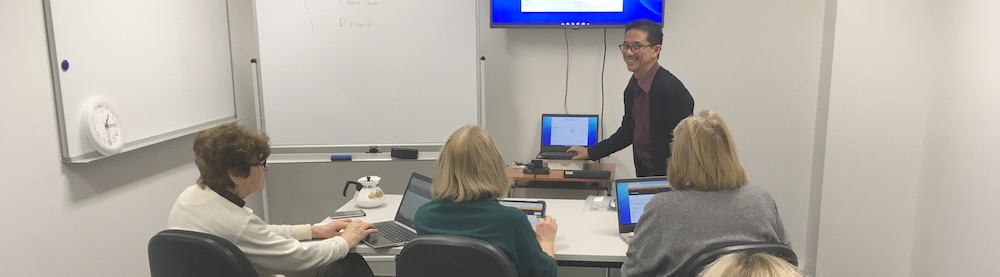
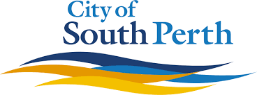
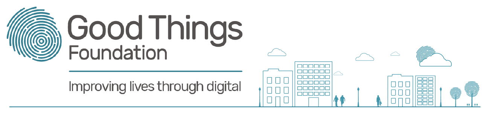

  

[[**One-on-One Sessions**](#one2one)] [[**Group Classes**](#group)]

For a limited time only, South Perth Learning Centre is offering FREE computer classes & smartphone classes for seniors, as personal one-to-one sessions or group classes!

Please call us on 0459 571 736 to book your free digital skills sessions which are held at our centre [96 South Terrace South Perth WA 6101](https://g.page/splcinc?share){:target="_blank"}, or you can book online by clicking the links below.

##  Free Digital Skills One-on-One Sessions
Got your knickers in a knot over a problem with your smartphone, tablet or laptop? You have a new device, but you don't really know what it can do? Why not sign up for a free personal one-on-one 30-minute troubleshooting session with our resident Tech Whizzes! Sessions are available every Tuesday and Friday mornings 10 am - 12 pm.

[Book FREE One-on-One 30-Minute Session](https://calendly.com/splc-beconnected/digital-skills){:target="_blank"}{:.btn}

## Free Digital Skills Group Classes

We have a wide range of free 1-hour group classes, these classes have a maximum of 6 students to ensure sufficient individual attention:

### Your Vaccination Certificate on Your Phone
You've had your COVID vaccination, and now you want to be able to substantiate it conveniently using your phone. This involves having your myGov & Medicare online accounts in order and available on your phone. Join this FREE 1-hour class to sort all of this out!

*Bonus: If you're a Qantas Frequent Flyer, we will also help you claim the [1000 points Qantas awards to vaccinated members](https://www.qantas.com/au/en/frequent-flyer/member-offers/been-vaccinated-be-rewarded.html){:target="_blank"} and enter their lucky draw for a year's worth of free flights, Accor accommodation or BP fuel.*

*Another Bonus: Bring your passport, and we can also setup your [internationally-recognised vaccination passport](https://www.abc.net.au/news/2021-10-19/international-covid-vaccine-certificate-passport/100548596){:target="_blank"}.*

[Enrol](https://docs.google.com/forms/d/e/1FAIpQLSf1BWKNcViD4-tdzi4b4cIvrHCW6SW9B87VjcjOoB5lfhzkew/viewform?usp=sf_link){:target="_blank"}{:.btn}

---

### Your Favourite Photos in One Place, One Tap Away
"Not enough storage", isn't that annoying when you want to capture your magnificent weekend trip? In this FREE 1-hour course, you will learn the easy, neat, efficient way to stash away your photos in one place.

[Enrol (iOS)](https://docs.google.com/forms/d/e/1FAIpQLSesynXBTyD7JqahQ8ecv9Xnlw4cMoRA9_G5lAJa9FaMqgg1HQ/viewform?usp=sf_link){:target="_blank"}{:.btn} [Enrol (Android)](https://docs.google.com/forms/d/e/1FAIpQLScoVrlyw_8JA2RMlicWWnr2R-AlUVmGrG5w4_Flzv5Q4iIyag/viewform?usp=sf_link){:target="_blank"}{:.btn}

---

### Getting Rid of Your Clutter on Gumtree
Want to try a new way to get rid of your clutter? In this FREE 1-hour course you will learn how to sell (or give away) your clutter online using Gumtree.

[Enrol](https://docs.google.com/forms/d/e/1FAIpQLSdyHjk8QBYIBm1QFgm4XSpf65_OK3405PxJqzzzOzbxTPqOCg/viewform?usp=sf_link){:target="_blank"}{:.btn}

---

### Mindfulness & Sleep Meditation Apps on Your Smartphone  
Thanks to the advances of technology, there are now smartphone apps that help you with your mindfulness practice. In this FREE 1-hour class, we will survey the different types of free and paid mindfulness and meditation apps that are available, and discuss the pros and cons of the different types.  

[Enrol](https://docs.google.com/forms/d/e/1FAIpQLSefAmOFvI0nJ5ihJ_CqhZK8L-0aRPkAv-VZcViMdQjFHHLL-Q/viewform?usp=sf_link){:target="_blank"}{:.btn}

---

### eBooks: 10,000 Library Books in Your Pocket
Did you know that using your smartphone/tablet, you can access free eBooks from the WA State Library? Come and learn how in this FREE 1-hour class, and walk out the class with 10,000 Library Books in Your Pocket!

[Enrol](https://docs.google.com/forms/d/e/1FAIpQLSfRKA_0ElcFoU61C2OPpSJusj9fwhUGEndnyfNAM2Et8w-4bQ/viewform?usp=sf_link){:target="_blank"}{:.btn}

---

### Storing & Organising Your Documents on 'The Cloud'
You might have heard of friends and organisations organsing photos, bills, tax documents etc. on 'The Cloud'. In this FREE 1-hour class, you will learn how to use The Cloud to safely store and organise your documents digitally, and have them instantly accessible across your devices.

[Enrol](https://docs.google.com/forms/d/e/1FAIpQLSeXbnOrW7EySrPLQTJG4h6HvVXRngaP_imj1RzqzAvdgcSbBA/viewform?usp=sf_link){:target="_blank"}{:.btn}

---

### More Classes to Come...
[Click here](https://splc.org.au/about/blog/8-blog/20-splc-beconnected-course-survey-results){:target="_blank"} to see a sample of the classes we will run soon here at SPLC!

*SPLC training laptops generously provided by:*  
  

*Be Connected initiative funded by:*  

