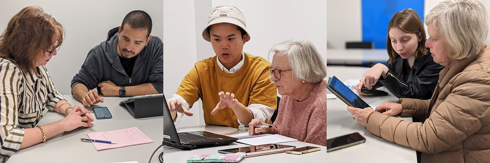
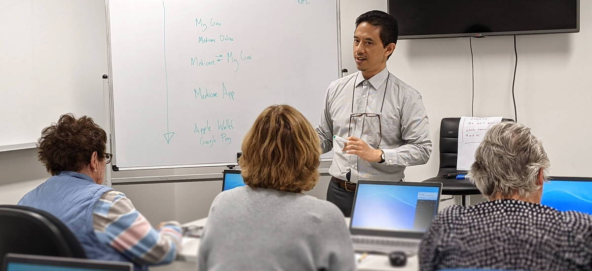

  

Come and book your FREE tech computer class and/or smartphone class by calling us on 0459 571 736, or you can book online by clicking the links below.

These sessions are held weekly at the [South Perth Learning Centre](https://goo.gl/maps/J9iKy2qk9turcHnW6){:target="_blank"} 96 South Terrace South Perth WA 6151, 

##  Smartphone SOS One-on-One
Got your knickers in a knot over a problem with your smartphone, tablet or laptop? You have a new device, but you don't really know what it can do? Why not sign up for a free one-on-one 30-minute troubleshooting help session with our resident Tech Whizzes! One-on-one sessions are available every Tuesday and Friday mornings 10 am - 12 pm, and Thursday afternoons 12:30 pm - 2 pm.

[Book FREE One-on-One 30-Minute Session](https://calendly.com/splc-beconnected/digital-skills){:target="_blank"}{:.btn}

---

## Group Classes

We have a wide range of free 1-hour group classes below. These free classes have a maximum of 6 students to ensure sufficient individual attention. Click the 'enrol' links below to register, or check the group class calendar [here](/calendar).

#### Vaccination Certificate on Your Phone
You've had your COVID vaccination, and now you want to be able to substantiate it conveniently using your phone, either on your Apple Wallet/Google Pay app, or on the [Service WA](https://www.wa.gov.au/organisation/government-of-western-australia/servicewa-mobile-app){:target="_blank"} app. Join this FREE 1-hour class to sort all of this out: your MyGov, MyGovID, Medicare App, Service WA and more!

And now that the WA borders are open, we can also help you sort out your International Vaccination Certificate.

[Enrol](https://calendly.com/splc-beconnected/vax-certificate-on-your-smart-phone){:target="_blank"}{:.btn}

---

#### Online Courses from Experts, Universities and Celebrities

Thanks to video streaming technology we can all do online courses provided by experts, celebrities and universities worldwide. In this FREE 1-hour workshop, we will explore and discuss the different types of free and paid online courses available, and show you how to access them. If you have a tablet or laptop, bring it along, and you soon will be up and running, attending an online course from home, in a cafe, or out the backyard!

[Enrol](https://classmanager.com.au/cbin/admin.php?Action=courses&single_course_id=1654&organisation_name=splc&from=org_home){:target="_blank"}{:.btn}

---

#### Council Kerbside Recycling Demystified
We often wonder whether something should or should not go into kerbside recycling. With the help of an Australian-developed smartphone app, in this 1-hour class we will help you demystify kerbside recycling! We will also help you install the app on your smartphone, so you always have a handy directory of what is/isn't kerbside recycling.

[Enrol](https://classmanager.com.au/cbin/admin.php?Action=courses&single_course_id=1583&organisation_name=splc&from=org_home){:target="_blank"}{:.btn}

---

#### The Magnificent World of Podcasts
Do you enjoy listening to the radio, but want to focus on specific themes or topics? Then Podcasts are for you! Podcasts cover a wide range of topics from true crime to sports and to world news. In this FREE 1-hour workshop we will explore podcasts, and discuss how to access a podcast on your digital device. Make sure to bring your tablet, or smartphone, and you'll soon be listening to your new favourite podcast!  
[Enrol](https://classmanager.com.au/cbin/admin.php?Action=courses&single_course_id=1653&organisation_name=splc&from=org_home){:target="_blank"}{:.btn}

---

#### Getting Rid of Your Clutter on Gumtree
Want to try a new way to get rid of your clutter? In this FREE 1-hour course you will learn how to sell (or give away) your clutter online using Gumtree.

[Enrol](https://docs.google.com/forms/d/e/1FAIpQLSdyHjk8QBYIBm1QFgm4XSpf65_OK3405PxJqzzzOzbxTPqOCg/viewform?usp=sf_link){:target="_blank"}{:.btn}

---

#### Mindfulness & Sleep Meditation Apps on Your Smartphone  
Thanks to the advances of technology, there are now smartphone apps that help you with your mindfulness practice. In this FREE 1-hour class, we will survey the different types of free and paid mindfulness and meditation apps that are available, and discuss the pros and cons of the different types.  

[Enrol](https://classmanager.com.au/cbin/admin.php?Action=courses&single_course_id=1584&organisation_name=splc&from=org_home){:target="_blank"}{:.btn}

---

#### eBooks: 10,000 Library Books in Your Pocket
Did you know that using your smartphone/tablet, you can access free eBooks from the WA State Library? Come and learn how in this FREE 1-hour class, and walk out the class with 10,000 Library Books in Your Pocket!

[Enrol](https://classmanager.com.au/cbin/admin.php?Action=courses&single_course_id=1585&organisation_name=splc&from=org_home){:target="_blank"}{:.btn}

---

#### Storing & Organising Your Documents on 'The Cloud'
You might have heard of friends and organisations organsing photos, bills, tax documents etc. on 'The Cloud'. In this FREE 1-hour class, you will learn how to use The Cloud to safely store and organise your documents digitally, and have them instantly accessible across your devices.

[Enrol](https://classmanager.com.au/cbin/admin.php?Action=courses&single_course_id=1650&organisation_name=splc&from=org_home){:target="_blank"}{:.btn}

---

#### More Classes to Come...
[Click here](https://splc.org.au/about/blog/8-blog/20-splc-beconnected-course-survey-results){:target="_blank"} to see a sample of the classes we will run soon here at SPLC!

*SPLC training laptops generously provided by:*  
  

*Be Connected initiative funded by:*  

